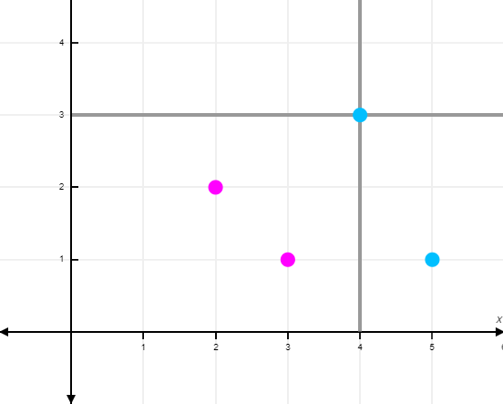

# Maximum Number of Matching Pairs

## Problem
### Input
Two lists of ordered pairs of real numbers, A and B, such as:<br/>
A = [(2, 3), (1, 3), (1, 3), (7, 4), (6, -1), (7, 5)]<br/>
B = [(-6, 4), (1, -2), (3, 12)]

### Definition
An ordered pair from A, (x<sub>a</sub>, y<sub>a</sub>), and an ordered pair from B, (x<sub>b</sub>, y<sub>b</sub>), can "match" if x<sub>a</sub> $\geq$ x<sub>b</sub> and y<sub>a</sub> $\geq$ y<sub>b</sub>.<br/>
An ordered pair from one list can only "match" ***one*** ordered pair from the other list.<br/>
Two ordered pairs from the same list can't "match".

### Output
The maximum possible number of matching pairs from lists A and B.

In the example above:
- All elements of A match (1, -2) from B
- No elements of A match (3, 12) from B
- Only elements (7, 4) and (7, 5) from A match (-6, 4) from B
- So, the maximum possible number of matching pairs from lists A and B is **2**, e.g., [(7, 4), (-6, 4)], [(6, -1), (1, -2)]

***Don't scroll down to the solution below if you want to try to solve this problem by yourself!***

There is an efficient solution to this problem. If you want to try to find it, give yourself plenty of time to think about it.<br/>
Tip: visualization of the ordered pairs as points in the plane may help. <br/>
.<br/>
.<br/>
.<br/>
.<br/>
.<br/>
.<br/>
.<br/>
.<br/>
.<br/>
.<br/>
.<br/>
.<br/>
.<br/>
.<br/>
.<br/>
.<br/>
.<br/>
.<br/>
.<br/>
.<br/>
.<br/>
.<br/>
.

## Solution

### Algorithm to Find the Maximum Possible Number of Matching Pairs
```
// Sort both A and B such that the x coordinates of their elements are ascending
SORT(A)
SORT(B)

LET numMatches = 0
LET i = 0
WHILE i < A.length AND B.length > 0
    IF A[i].x >= B[0].x
        LET indexNearestY = -1
        LET j = 0
        WHILE j < B.length AND A[i].x >= B[j].x
            IF A[i].y >= B[j].y
                IF indexNearestY == -1 OR B[j].y > B[indexNearestY].y
                    indexNearestY = j
            j = j + 1
        IF indexNearestY >= 0
            numMatches = numMatches + 1
            REMOVE(B, indexNearestY) // Method to remove element B[indexNearestY] from B. Reduces B.length by 1.
    i = i + 1

RETURN numMatches
```

Note: This algorithm can be modified to store matches between elements of A and elements of B in a data structure and then return this data structure. The data structure would be of maximum possible size.

### Explanation of the Algorithm and Proof of it's Correctness
First, A and B are sorted such that the x coordinates of their elements are ascending. Then A is traversed in order.

If the x coordinate of the current element of A is less than the x coordinate of the first element of B, then the current element of A can't match any element of B (due to the ascencion of x coordinates), so the algorithm moves on to the next element of A.

In the opposite case (when ```A[i].x >= B[0].x```), the algorithm traverses B in order until either the end of B is reached or it finds an element of B with a greater x coordinate than the x coordinate of the current element of A, in which case the remaining, untraversed elements of B can't match the current element of A. But the traversed elements of B possibly can.

For every element of A, the algorithm traverses all elements of B that can possibly match it and checks whether any do. So, the algorithm doesn't miss any possible matches. If the algorithm finds a match, it keeps track of the index of the matching element of B with the greatest y coordinate value. After traversing B, the algorithm removes this matching element from B and increases the count of matches by 1. Removing this element ensures the algorithm doesn't count it as a match for any other element of A.

So, why does this algorithm find the ***maximum*** possible number of matches?

Visualize the ordered pairs of A and B as points in a Cartesian coordinate plane. Let a be an element of A. The geometric lines x = a.x and y = a.y divide the plane into 4 regions. Only elements of B in the lower left region match a. The algorithm traverses the elements of A from left to right. Every element of A, a, that can match an element of B is matched with the highest unremoved element of B (the one with the greatest y value) in the region below and to the left of a.



For example, if<br/>
A = [(4, 3), (5, 1)]<br/>
B = [(2, 2), (3, 1)]<br/>
then (4, 3) is traversed first and it's matched with (2, 2). (4, 3) can also match (3, 1), but if it were matched with (3, 1), then (3, 1) could not be matched with (5, 1), in which case only (4, 3) would be matched with an element of B, whereas if (4, 3) is matched with (2, 2), then (5, 1) can be matched with (3, 1).

The algorithm ensures the maximum possible number of matches is made. The first (leftmost) element of A that can match an element of B is matched with one such that the kind of problem I described is avoided. If a subsequent element of A can match with the element of B the first matched element of A is matched with, then it can also match with any of the other elements of B that the first matched element of A could have been matched with. So, the first match made doesn't decrease the possible number of matches that can be made overall. The first matched element of A and the element of B it's matched with can be taken out of consideration (the algorithm does this by incrementing i by 1 and removing matched elements of B) with the count of matches made being increased by 1. The problem of making the maximum possible number of matches with the remaining elements of A and B is the same as the original problem, so the same approach can be taken to it (which the algorithm's outer loop does).

### Computational Complexity
#### Time Complexity
**O(N<sup>2</sup>)**, Quadratic

This is a vast improvement over the time complexity of a brute-force algorithm that computes every possible list of simultaneous matches that can be made so it can then return the maximum possible number of matches that can be made.

Note: the time complexity of the REMOVE method could be O(N) depending on how it's implemented, but this doesn't change the algorithm's overall time complexity.

#### Space Complexity
**O(N)** or **O(1)** or the space complexity of the sorting algorithm chosen

If it's preferable not to remove elements of list B, then a copy of list of B can be made so that elements can be removed from the copy instead. Alternatively, a boolean array could be used to keep track of which elements of B have "removed" status. In either case, the space complexity of the algorithm would then be O(N).

If the REMOVE method creates a new data structure (when an array is resized, for example), then it's space complexity is O(N).

## Application
Suppose you have a list of items (list A) and a list of specs for items (list B) and you're tasked with matching up the items with the specs such that only one item can be matched with a spec. Each spec consists of values for the same two numerical attributes. For an item to meet a spec, it's values for these two numerical attributes must both be greater than or equal to the corresponding values for these attributes in the spec. In other words, the item must "match" the spec. My algorithm can find the maximum number of specs that can be met simultaneously. The modified version of it can produce a data structure of matches between items and specs of maximum possible size.
